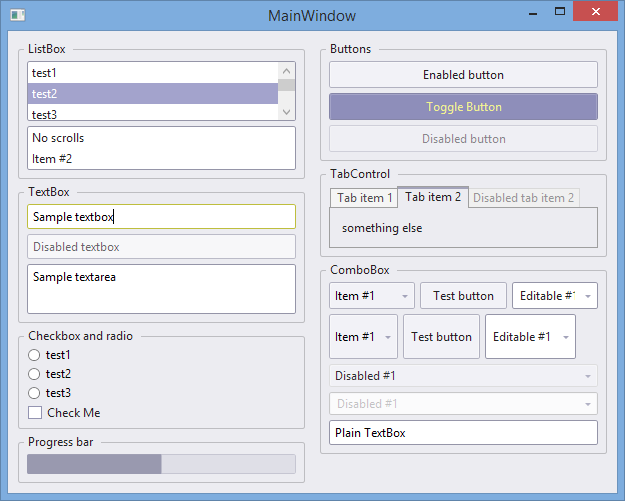

# candyshop
Themes/skins for Windows Presentation Foundation (WPF)

## Screenshot


## Integration with your project
1. Reference `Candido` in your project.
2. In `App.xaml` under `<Application.Resources>` you need to add following code:
```xaml
<ResourceDictionary>
  <ResourceDictionary.MergedDictionaries>
    <ResourceDictionary Source="/Candido;component/Hybrid.xaml" />
  </ResourceDictionary.MergedDictionaries>
  
  <!-- Workaround for ResourceDictionary bug/optimization. Don't remove line below. -->
  <Style TargetType="{x:Type Rectangle}" />
</ResourceDictionary>
```

### Note about windows
Styles will be applied to all controls except Windows. You need to apply Window style manually:
```xaml
<Window Style="{StaticResource Hybrid.WindowTheme}">
```

## Spacing property
Have you ever thought how to optimize following code?

```xaml
<StackPanel>
  <Button Margin="0,0,0,10">Button 1</Button>
  <Button Margin="0,0,0,10">Button 2</Button>
  <Button Margin="0,0,0,10">Button 3</Button>
  <Button Margin="0">Button 4</Button>
</StackPanel>
```

You can do it as easy as:
```xaml
<StackPanel xmlns:candido="clr-namespace:Candido;assembly=Candido" candido:Spacing.Vertical="10">
  <Button>Button 1</Button>
  <Button>Button 2</Button>
  <Button>Button 3</Button>
  <Button>Button 4</Button>
</StackPanel>
```

In this example it will automatically add bottom margin for all controls except last one. So the margin will be applied between controls. You can do the same with:
```xaml
<StackPanel
  xmlns:candido="clr-namespace:Candido;assembly=Candido"
  candido:Spacing.Horizontal="10"
  Orientation="Horizontal">
```
In this case it will space items horizontally (set right margin except last control).

To keep it short, you can move xmlns declaration to parent element, for example:
```xaml
<Window xmlns:candido="clr-namespace:Candido;assembly=Candido">
  <StackPanel candido:Spacing.Vertical="10">
    <Button>Button 1</Button>
    <Button>Button 2</Button>
    <Button>Button 3</Button>
    <Button>Button 4</Button>
  </StackPanel>
  <StackPanel candido:Spacing.Horizontal="10" Orientation="Horizontal">
    <Button>Button 1</Button>
    <Button>Button 2</Button>
  </StackPanel>
<Window>
```
